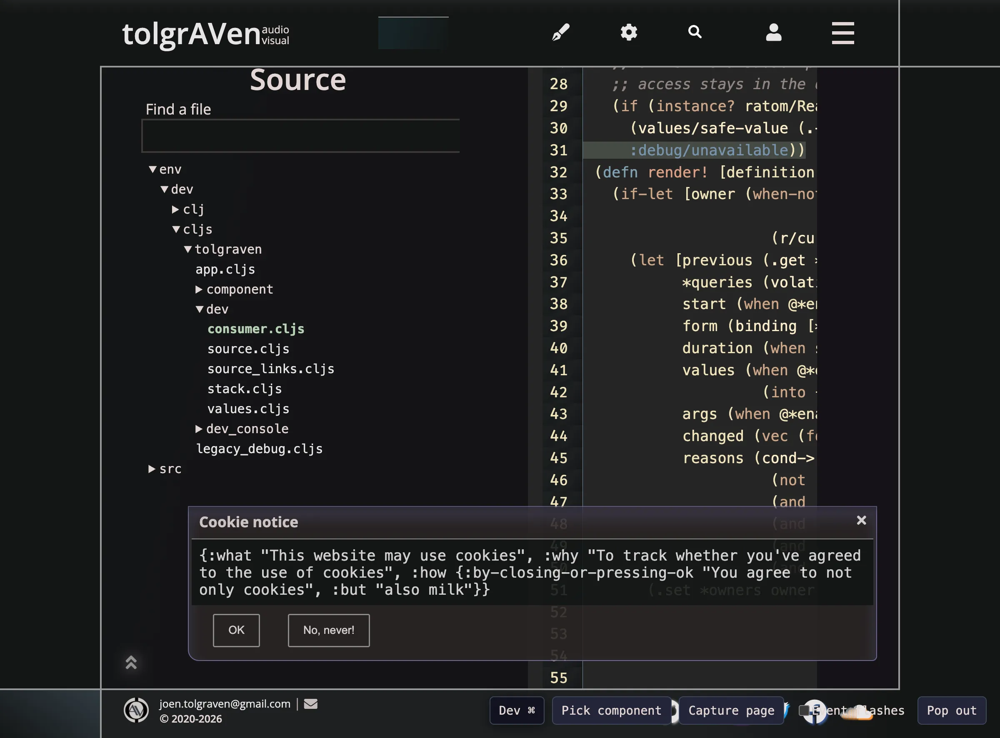

# Development console

The console and profiling implementation live in `env/dev/cljs/tolgraven/`.
`:app-dev` and `:app-test` enable Shadow's `:dev` reader feature. Production and
Node SSR omit those dependencies at read time, including their registration
side effects and inspector schemas; `goog.DEBUG` is not their import boundary.

In `:app-dev`, click **Dev** or press **Alt+Shift+D**. The console mounts after
hydration, so it does not change the first client tree. Release builds do not
mount it or run capture adapters. Application views use the existing Reagent,
re-frame shim, and scoped state helpers throughout.

## Inspecting the app

- **page**: active Reitit match, its composed page spec, and persistent page state.
- **components**: a component-only React hierarchy with live instance keys and
  expandable children; native DOM elements are omitted. Loaded, unmounted
  declarations remain available as ready nodes. Previously observed children
  retain their known placement where it is unambiguous; other declarations are
  grouped by namespace. Details exposes dependencies, declarations and resolved
  app-db paths; “Inspect state path” opens the state editor. Branches paginate
  siblings and mount their details only when expanded. Inspection never mounts
  hidden application components or loads an unloaded module.
- **modules**: composed routes, loaded module declarations and module state.
- **state**: expandable, typed maps/vectors/lists/sets and scalar values. Enter an
  EDN path to subscribe to it, or set its value through the normal state event.
- **subs**: autocomplete registered IDs or existing live query vectors, edit arguments, then press Enter or **Run subscription**. Invalid EDN, missing handlers and nil results have visible feedback. The separate path input completes child keys from a scoped subscription and **Run path** inspects that exact app-db path. Typing does not acquire data sources. The scoped-state picker resolves the active page, loaded modules, mounted namespace/key-specific components/views, and live scoped fields. Mounted probes report the dependencies resolved using their actual arguments; dependency buttons open the normal content/readiness/cache subscriptions. No hidden component is mounted to inspect it. The selected result and live query inventory are labeled separately. Its consumer mounts and dereferences
  the normal subscription, and releases it when this tab closes. Managed data
  subscriptions can therefore acquire their normal sources. Live queries are also listed.
- **loads**: shared dependency resource owners/status, loading state, and content stores.
- **events**: dispatch an EDN event and inspect its settled synchronous cascade,
  effects, timing and bounded before/after diffs. The optional override switch
  stubs the named common effects only; it is not a sandbox for arbitrary events.
- **errors**: existing diagnostics, preserving the application's HUD/fallback flow.
- **timings**: select an event window, inspect nested re-frame traces and React
  commit bars, and click a bar for its details. Durations include child work;
  this is an instrumented event/commit timeline, not a CPU sampling profiler.
- **layout**: a selectable layout-shift graph with nearby event/commit markers, source elements and rectangles. Filter by time or shifts outside recent input. Inspector-only shifts are excluded to avoid recording/display feedback; page, mixed and unknown shifts remain. Score totals are raw retained sums, not the browser CLS metric. Nearby events are correlation, not proof of cause.
  Layout-shift observation depends on browser support; user-input shifts are
  retained too, because they matter when diagnosing comment expansion jumps.
- **code**: component declarations, feature/dependency options, source locations
  and instrumented handler metadata. Unloaded module code appears after loading.

The tree opens its first two levels, then expands on demand. Collapsed collections
show inline keys and short values, including shallow previews of child collections.
Vectors of maps use one map marker and a count, for example `[{} × 2]`, while
retaining access to each map through expansion.
Map keys share a column sized to the longest key (capped at 36 characters), wrap
when needed, and expose the full key on hover. Vector indexes stay on one line.
Repeated events are grouped by event ID regardless of arguments. Trace operations
and component commits are grouped by operation/component and phase. Groups show
counts and summed duration; expanding a group exposes the original, paginated
occurrences. The timeline still uses the original records.
Timing fields display durations with ms/s units and relative h/m/s/ms clocks plus
absolute UTC timestamps derived from `performance.timeOrigin`; hover retains the
original numeric value. Numbers stay yellow, elapsed clocks are blue, and absolute
timestamps are purple. Vector brackets have brighter aqua accents and a heavier
expanded enclosure.
Event inputs and the timing event selector complete registered event IDs and
small captured event vectors, including arguments. Selecting a suggestion only
fills the input; dispatch still requires the explicit action. In timings,
`[event-id]` selects captured windows for every argument combination; a longer
vector narrows the prefix. **Hide :sub/run** defaults to on and removes those
traces from both bars and grouped history without discarding the captured records.
Maps use curved right braces; vectors use full-width square brackets, lists use
parentheses, and sets use dashed braces. Delimiters and scalar syntax use the
accent palette from `resources/scss/vars.scss`; surfaces stay cool blue-purple.
Collections and active component lists show 10 items per page; Next replaces the current page rather than appending more DOM. Small collections fully represented by the inline preview have no expansion control. Large child collections remain collapsed until requested. **Clear** clears history without losing mounted-instance tracking.
**Record** pauses trace, epoch and layout observers and commit recording, while
mounted-instance tracking stays current. Console events and their trace descendants
are excluded, and the console's root host is not profiled, preventing capture loops. Dependency readiness reads use scoped subscription
results rather than making the rendering page depend on the entire app-db;
storing debug history therefore does not trigger more page renders.

Records drain in batches every 200 ms. History defaults to 500 entries, capped at
2000; queued records and retained payloads are also bounded. Whole app-db snapshots,
reactions and SDK objects are not retained in trace/settled-event records. Diffs are
previews, so use the state inspector for complete current content. Debug history
is not automatically persisted or uploaded.

## Component identity and registry

Components are registered by their actual function identity in a WeakMap. The
inspection catalog keys declarations by `[namespace component-name]`, replacing
that entry on hot reload. Identical names in different namespaces are supported;
component state already includes namespace, name and optional instance key.

Registration lets preloading acquire a component's declared dependencies before
it mounts, and lets the composable runtime resolve features/state/loading without
rendering it. It does not eagerly mount or fetch every registered component.
The `<loading>` macro helper only supplies a missing local helper: an existing
namespace definition, referred/renamed var or argument binding takes precedence.

Use `{:profile false}` in a `defc` declaration to omit its render timing callback
while retaining its place in the component hierarchy. This is used for the root
that hosts the console itself. Probes use React context for parentage and Profiler for timings and
add no DOM wrappers; native roots get `data-dev-component` for layout attribution.
Attribution attributes are added only after hydration; server and first-client
markup stay unchanged. Server rendering never runs observers.

## Hydration indicator

`[:options :dev-console :hydration-highlight?]` defaults to true under
`goog.DEBUG`, false in release. After actual hydration, a 150 ms brightness overlay
appears over `#main`; it changes no dimensions and ignores pointer input. It is
suppressed for reduced motion. Ordinary navigation does not retrigger it.

```clojure
[:dev-console/option :hydration-highlight? false]
[:dev-console/option :recording? false]
[:dev-console/option :limit 1000]
```

## Using it through re-frame-pair

Follow [re-frame-pair setup](re-frame-pair.md), starting each session with:

```sh
bb pair discover-app
bb pair dispatch '[:dev-console/clear]'
```

Open the console before inspecting `[:dev-console/snapshot]`. Read its existing
mounted reaction instead of creating a dangling subscription:

```sh
bb pair eval-cljs \
  '(when-let [reaction (some (fn [[_ r]] (when (= [:dev-console/snapshot] (re-frame.tooling/query-v-for-reaction r)) r)) @re-frame.tooling/query->reaction)] @reaction)'
```

The snapshot includes the route, options, mounted instances/resolved paths and
bounded records. **Copy snapshot** copies the same EDN to the local clipboard.
Closing the panel disposes its inspector subscriptions. When the last panel,
picker, selected popup and explicit page-capture owner closes, the host unregisters
trace/epoch
callbacks, disconnects the layout observer, disables Profiler callbacks and clears
the pending drain timer/queue. A small mounted-instance index and the toggle's
keyboard shortcut remain; dependency details resolve only when opened. Reopening
backfills currently mounted instances without replaying their component mounts.
**Record** pauses tracing while keeping the open inspector's instance list current.
For exact handler sources, cascade tracing and post-mortems, use the installed
skill's `handler-source`, `trace-recent` and `watch-epochs` commands alongside it.
The console uses native `re-frame.tooling` trace/epoch callbacks and
`dispatch-and-settle`; it does not install another event-error handler.

`re-frame-pair` itself installs an error-capture bridge once per browser runtime.
Re-frame may log “overwriting :error handler for :event-handler” when it replaces
its default handler. That warning is not an application handler exception.


## Diagnostics on the page

**Pick component** selects the nearest instrumented native root without activating
its normal click action. Escape cancels selection mode. Its persistent popup uses
CSS anchor positioning, flips when it needs room, and remains open without hover.
It shows the resolved scoped app-db path, live state, acquired query vectors,
recent timings and observed render reasons. **Show on page** in profiling and
component flamegraph bars selects the same instance. A measurement adapter owns
the outline and releases its scroll/resize listeners and ResizeObserver on close.
Views with fragment or React interop roots highlight their nearest native descendants;
the inspector does not insert wrappers to manufacture a root.

**Capture page** records while the panel is closed. Add `?diagnostics=1` to a
development URL to start capture before the first application render. Early records
remain in the bounded adapter queue until the console host commits; capturing
startup must not publish app-db updates into an uncommitted inspector. **Record**
pauses timing capture without losing component metadata. Capture is bounded by
**limit** (500 by default, at most 2000 records); its own events, subscriptions
and component state are excluded. **Event flashes** adds a short CSS class
animation to scoped containers changed by an event, and to views whose observed
subscription results changed. No diagnostic code mutates application DOM classes.
Reduced-motion preferences disable those animations.

The timings summary separates **view** body execution from inclusive React subtree
**render** work and exact **subscription** query vectors. It shows run counts,
total, average, maximum, and React mount/update counts over the retained window.
Subscription samples come from trace batches containing an application event;
standalone recomputations outside those batches may be absent. This excludes
diagnostic-only invalidations and prevents the capture from feeding itself.
Search owners/queries to find expensive processing, then open their source.
Flamegraph controls zoom and pan the event window; clicking a component bar
opens its page inspector. These are instrumented development timings, not CPU
sampling or production measurements. View-body samples exclude separate
declaration/lifecycle setup, and Profiler samples cover the returned subtree.
Child work appears in multiple inclusive
Profiler durations, so do not sum those durations as elapsed wall time.

Observed render reasons compare bounded argument and subscription result previews.
They identify changed arguments/results or report an unclassified change. Local
state, context and parent updates are not fully explained by this evidence.
Queries acquired in a component's `:let` are retained with their native reactions;
conditional queries can remain listed until unmount. Acquisition metadata retains
at most 100 query identities per owner. Starting capture establishes a baseline
rather than claiming arguments changed. The dev adapter reads Reagent 2 cached
reaction state without dereferencing it: ordinary deref outside tracking can flush
pending renders or revive stale queries. Unknown reaction types remain unresolved.
No extra app-db watches or
application store are introduced. Explicitly expanding a query result mounts a
normal managed subscription and therefore adds observer overhead.

**Pop out** opens the console only on explicit button intent. React portals render
into its document while sharing the parent application's registry, records and
re-frame runtime. It never bootstraps a second application. Closing that window
opens the panel on the page; closing the parent releases the window/listeners.
The component tree and captured event history have text search; event-vector
completion remains available for exact argument-prefix filtering.

## Source documentation and schema failures



Development docs include `/docs/source` and `/docs/source/<repository-path>#L42`,
with a searchable file tree, Bruvbox-highlighted listings and line numbers. Only
CLJ/CLJC/CLJS files under the explicit source roots enter the backend catalog.
Configuration/resources, symlinks, traversal paths and files over 512 KiB are
excluded. Both `/api/dev/source-catalog` and `/api/dev/source` exist only when
the server's development flag is true; source routes and implementation imports
are absent from production and Node graphs.

Fallback stacks resolve same-origin Shadow `cljs-runtime/*.js` source maps using
the installed ClojureScript decoder. Mapped repository frames link to their
original line. Missing maps, external frames and ambiguous catalog paths remain
plain text; generated JavaScript line numbers are never presented as source lines.
Source files/maps use normal managed dependencies and their bounded cache;
subscriptions expose those results without duplicating file/map payloads in app-db. Map decoding is shared by a derived subscription per URL. A line revealed after the
formatter loads requests the normal page positioning event from its ref adapter.

Development Malli issues include bounded received values/types and the required
schema, styled by value type. Password/token/secret/credential fields are redacted.
Details live in development-only vector metadata; ordinary issue maps retain only
path/message, and release/Node validation never imports this implementation.
