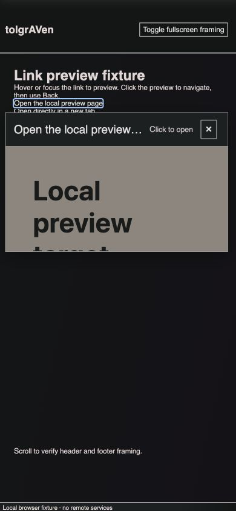

# External link previews

External links in blog markdown, chat, user comments and search snippets can open
an iframe preview on hover or keyboard focus. The first touch opens the preview;
activating it expands the surface before navigating. Escape, the close button,
and a pointer outside the preview dismiss it. Escape also cancels navigation
while the expansion is in progress. Back restores the source scroll position and
reverses the transition when its link is available.

The iframe and popover are independent components. Host-specific renderers can be
registered with `tolgraven.modules.link-preview.views/register-provider!`. The lazy
`:link-preview` module owns discovery, subscriptions, prefetch pacing and the
transition controller, with matching dependencies in development and production.

Candidate URLs are cached from raw text. Only containers with candidates get an
IntersectionObserver; changed text and component unmounts clean up their links,
observers, listeners, queued prefetch markers and hover timers. `defc` supports
`:links {:id ... :text ... :trust ...}` on a DOM-root component through a composed
ref, preserving caller refs without adding wrappers. Its existing experimental
examples, macroexpansion and disabled call sites remain in `views/auto.cljs`.

Author trust controls automatic requests. Admin-authored blog content allows
markdown images/raw HTML and script/form capabilities in sandboxed iframes;
ordinary users get slower document prefetch and a restrictive iframe sandbox;
anonymous/unclassified content gets no automatic prefetch. Previews and prefetch
suppress referrers. Same-origin links, downloads, explicit new-tab links and
`data-no-preview` links retain ordinary behavior. Websites can still refuse
embedding through their own frame policy; the direct link remains available.

## Verification

- Browser suite: 14 tests, 99 assertions, including macro ref/update/unmount,
  hover cancellation, touch opening, keyboard activation, Escape cancellation,
  outside dismissal, URL filtering, sandbox selection and prefetch cleanup.
- Advanced production build and changed-source lint pass. The production
  controller is emitted in `link-preview.js`, not the main bundle.
- CSS build and the backend suite pass (42 assertions in two backend tests).
- Local Chromium fixture: sandboxed iframe rendering, Enter navigation, Back,
  and widths 390/401/1280 checked. Header/filler/main borders agree across the
  400px breakpoint. This does not replace a physical iPhone/WebKit check.
- Existing dependency warnings remain: two `rrb-vector` compiler warnings, Sass
  color interpolation warnings, and outdated Browserslist data.



## Reproduce the isolated browser fixture

The fixture renders real components and styles without initializing backend services.
Serve from a loopback address only. It uses `localhost` and `127.0.0.1` on the same
port as distinct origins for the iframe and navigation target.

```sh
npm run build
lein with-profile +project/test run -m shadow.cljs.devtools.cli compile app-test
cp test/browser/preview*.html resources/public/js/tests/
cp resources/public/css/tolgraven/main.min.css resources/public/js/tests/preview.css
python3 -m http.server 4002 --bind 127.0.0.1 --directory resources/public/js/tests
```

Open `http://127.0.0.1:4002/` for the tests and
`http://127.0.0.1:4002/preview.html` for the interactive fixture. Hover/focus its
link, use Enter or click the preview, then use Back. Test the close button,
Escape, new-tab link, viewport resizing and the fullscreen-framing toggle.
