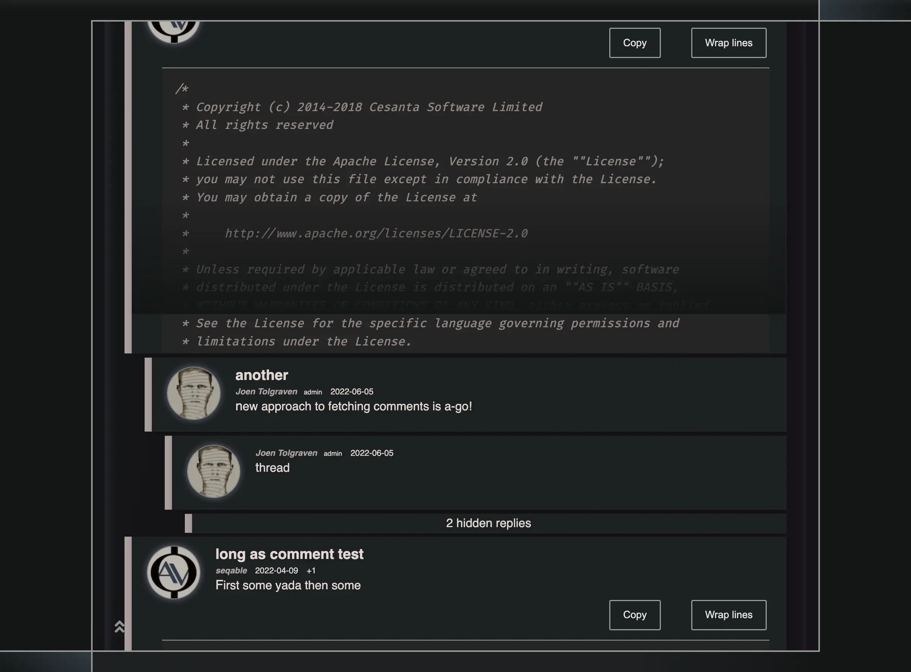

# Module stylesheets

`npm run build` compiles the shared `resources/scss/main.scss`, `dev.scss`,
`icons.scss` and the entry files
in `resources/scss/modules/` through the locked Sass and Autoprefixer packages.
Outputs are `resources/public/css/tolgraven/main.min.css`, `dev.min.css`, `icons.min.css`, and
`modules/<feature>.min.css`. The development document alone links `dev.min.css`,
which contains inspector styles; production shell and error pages share the same
fingerprinted shell link without loading those rules. Shared validation-error
markup stays in the common component error stylesheet. `npm run dev` watches both shared and module sources.
Set `CSS_OUTPUT_DIR` to build into a separate directory for comparisons.

Shared shell/layout rules live in `scss/shell`, reusable component rules in
`scss/components`, and feature implementations in `scss/modules/<feature>`.
Shared rules retain ordinary selector specificity; feature rules use their
module selectors and remain installed across navigation. Avoid splitting rules
that rely on ordering between equally specific selectors across features.
Keep mixins in CSS-free `scss/tools` partials: importing a
feature for a mixin would duplicate its selectors in another module's output.
`all.scss` remains an explicit combined preview entry, outside the normal build.
The `:home` sheet owns landing hero/page rules. Its module also declares the shared
Markdown/monospace sheets for its static rendered text, without a JavaScript
dependency on the parser. Initial route styles include the global User controls
but exclude the Link Preview popup sheet even on Blog. Its static
`display: contents` container rule belongs to Markdown, keeping SSR layout intact.
The optional `:styled-input`
module owns the custom field used by Search and blog editing. It, Markdown and
the deferred highlighter declare the independent monospace sheet, containing FiraCode's font declaration.
The highlighter shares Markdown's code/control sheet too, so standalone code consumers acquire their styles.
The common shell contains neither. Browsers acquire the font URL only when a rendered consumer uses
its glyphs; do not preload it merely because a Markdown module is loaded.

Each feature's literal module spec declares `:styles` with its local output URLs.
The existing module declaration reader generates the shared stylesheet catalog
at compile time, including transitive bundle dependencies. No browser feature
code must load to discover its CSS. A module may declare `:ssr-styles :deferred`
when its styles apply only to intent-driven UI absent from SSR, such as a preview
popup. The default is `:initial`; dependencies retain their own policies.
This only filters initial head styles: the full loader inventory and synchronous
CSS acquisition before Shadow remain unchanged. Do not defer styles needed by
visible static SSR content. Declaration macros register the entry sources
as Shadow resources so metadata changes invalidate their baked catalogs in
incremental builds. Restart Shadow watches after adding or removing module entry
files so build discovery sees the changed set.

Optimus bundles each declared stylesheet separately and publishes content-addressed asset
URLs with long cache lifetimes. The shared shell sheet stays a blocking,
cacheable link. Small initial route/dependency sheets are inlined from Optimus's
optimized contents, within a 16 KiB document budget, eliminating separate
feature requests before first paint. Larger sheets retain stylesheet links;
development keeps links for CSS watching. The `data-module-style` attribute
associates each inline sheet with its immutable URL in the small `#module-styles`
JSON inventory. The loader treats that sheet as already ready, avoiding duplicate
requests. Streamed skeletons and completed SSR pages share the initial head. The shell
retains the centered body width when it leaves document flow to dissolve.
Local return documents include their saved modules' CSS as links in the head.
When modules share a stylesheet, their manifest entries reference the same bundle;
the initial head and browser loader deduplicate that URL. Keep declared output
names distinct: the catalog rejects stylesheet bundle-name collisions.

The browser module loader starts CSS acquisition synchronously before calling
Shadow's JavaScript loader. React DOM `preinit` owns insertion and deduplication;
a small lifecycle adapter observes load/error with listener and timeout cleanup.
Code readiness waits for both CSS and JS, before installation or rendering.
CSS stays installed across navigation for cached modules. A failed request is
retryable through the existing module failure UI; retries use a new URL because
React retains resource records by href. Data acquisition remains independent.

Leaflet CSS and images come from the locked npm package, through the `:maps`
bundle dependency. They do not require a separate CDN version.

Verify initial head links, cold SPA acquisition timing, dependency CSS, failure
and retry, both navigation directions, hydration and document/history returns.
Use a separate production server with advanced compiled browser assets and the
Node renderer for performance measurements; port 4000's development assets are
not representative. See [testing.md](testing.md).

Module references defer code/data activation until proximity or explicit intent;
SSR styles remain available for the static view before hydration. CSS acquisition
starts directly when the module request starts, shares its in-flight promise, and
retries a failed CSS/code request once after three seconds before showing an error.

## Text font upgrades

Fira Code belongs to the independent monospace sheet. Its initial face uses
`font-display: optional`: a font unavailable within the browser's short initial
period does not later swap over visible SSR text automatically. The separate
`Fira Code Ready` family shares the same immutable font URL and is loaded through
`document.fonts.load` by the owning component. This adds no font to plain routes
or closed Search. Search's field/suggestions activate the feature only when open;
fenced blocks and inline snippets own it when rendered.

A pending face keeps the original font stack visible. Once the ready face has
loaded, the native root fades out for 100ms, changes its font variable at zero
opacity, paints for two frames, and fades in for 100ms. Readiness and phases are
re-frame events; animation completion uses Reagent event props with guarded
`:dispatch-later` deadlines. Already loaded initial faces retain the browser's
first-paint choice without animation. Reduced motion and local-return documents
skip the fade. Failure or the ten-second load deadline leaves readable fallback
text; stale completions cannot revive an expired attempt or an unmounted owner.
Font loading never blocks hydration or the page-ready gate.

`Fira Code Fallback` uses locally installed Courier New. Its `size-adjust` is the
Retina font's advance ratio (1228/1229); its ascent/descent overrides divide the
Retina metrics by that ratio. This preserves monospace advances and line height
on systems with Courier New. Other systems use generic monospace, so exact metric
matching is not guaranteed there. The fade smooths the visual replacement; it
cannot interpolate kerning or glyph shapes. Open Sans retains its existing shell
policy; the Fira change does not fade the whole document.

The resulting code typography and controls:

## Declared SVG icons

Declare literal dependencies beside their rendered owner, for example
`{:icons ["brands/github" "solid/copy"]}` in a `defc`, module spec or page route
data. Component/page declarations in a module folder belong to that module;
shared declarations belong to `:main`. An explicit `:module` may select another
known owner. Declarations must use literal vectors and known Font Awesome family
names; computed dependencies and missing glyphs fail generation.

`bb fonts:icons` reads these declarations without requiring browser namespaces.
It exports original glyph outlines, advance widths and baselines to committed
`resources/public/img/icons/generated/` SVGs and generated SCSS. Viewports contain
transformed ink bounds, including overhangs. Expanded mask boxes use compensating
relative margins to retain the original advance, line-box height and baseline.
Shared masks
compile into the shell; feature masks get an automatically catalogued
`icons-<module>.min.css` dependency. Shared icons satisfy feature declarations
without duplicating their masks. Small SVGs are inline CSS data URLs, so selected
icons incur neither a separate image request nor a font download/swap. Existing
Reagent `:i.fab.fa-github`/`:i.fas.fa-copy` markup and `currentColor` remain usable.
Regenerate after changing declarations; commit generated SVGs and SCSS together.
The generator removes stale files only in its owned generated paths. Normal CSS
(and Docker) builds use these committed outputs, without Python/fontTools.

Shadow tracks existing icon declaration sources for incremental changes. Restart
the watch after introducing an icon declaration in a previously untracked source.
The source adapter is `.cljc` for the JVM/Babashka reader boundary; it does not
execute frontend code or create a runtime schema inventory.

## Icon fonts

The deferred `icons.css` bundle uses `icons.scss`, which imports the vendored Font
Awesome selectors and generated font faces into one compressed Sass output.
Development links that same watched output. Optimus fingerprints the sheet and
rewrites all of its font URLs, so repeat visits can reuse font bytes without
caching mutable original paths.

`bb fonts:icons` regenerates small WOFF2 faces from the vendored originals. It
collects literal `fa-*` names from application source and the CMS-driven names in
`resources/icon-fonts.json`; commit that catalog, the generated SCSS and both fonts.
The generated faces have disjoint Unicode ranges: known glyphs use the small
fonts, while other glyphs acquire the original full font when actually rendered.
A failed subset request can also fall back to the full font through native CSS
source selection.
Keep full originals and selectors available for new CMS icons. Regenerate after
adding literal icons, changing catalog names, or replacing the vendored fonts.

Generation uses Python with `fonttools==4.60.2` and `Brotli==1.2.0`. These are
optional authoring tools, not server or Docker build dependencies; normal CSS
builds compile the committed generated SCSS. For an isolated setup, install them
in a virtual environment and run `bb fonts:icons` with that environment on PATH.
The generator retains font license/copyright records and names derivative fonts
separately. Verify glyph outlines/metrics, fresh-browser requests, the full-font
fallback and cache headers after changing it.

Build CSS as UTF-8 without a byte-order marker (`charset: false` in Sass). The
server also strips a leading marker before inlining third-party/optimized sheets;
a marker inside an HTML style element becomes part of its first selector.

Carousel controls/views and their independent sheet belong to `:carousel`. Home, CV
and Strava declare the bundle dependency; Blog and Search acquire neither its code
nor its stylesheet. Shared UI compatibility exports delegate to that owner.
